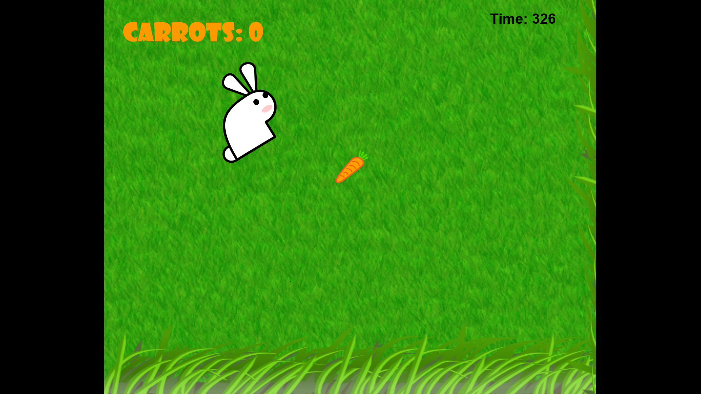

#Feed the Critter Starter Kit

###Author(s): Edwin Guarin
###Date: 9.16.2013
###Version: v1.0.0
###URL: https://github.com/wingamekits/FeedTheCritter

----------
##Description

The Feed the Critter Starter Kit is a Construct 2 template for a simple game through which you direct the "critter" to as many objects as possible before times runs out.

**Note: this template is optimized for Windows 8. Updates are planned to improve the experience for both Windows 8.1 and Windows Phone 8** 

Sample screen from ["Feed the Bunny!" in the Windows Store][4].

##Requirements

 - Windows 8
 - [Visual Studio 2012 Express for Windows 8][1] or higher
 - [Construct 2][2] free edition
 

##Setup and Customization
 - Download the starter kit ZIP file and extract its contents
 - Open the *FeedTheCritter.capx* file in Construct 2
 - Follow the customization steps in the *CustomizeGameHere* event sheet
 - Add further features to the application by editing the layouts and associated event sheets
 - Consult the [store publication PDF document][3] for the steps to submit to the Windows Store

##DISCLAIMER: 

The sample code described herein is provided on an "as is" basis, without warranty of any kind, to the fullest extent permitted by law. Both Microsoft and I do not warrant or guarantee the individual success developers may have in implementing the sample code on their development platforms or in using their own Web server configurations. 

Microsoft and I do not warrant, guarantee or make any representations regarding the use, results of use, accuracy, timeliness or completeness of any data or information relating to the sample code. Microsoft and I disclaim all warranties, express or implied, and in particular, disclaims all warranties of merchantability, fitness for a particular purpose, and warranties related to the code, or any service or software related thereto. 

Microsoft and I shall not be liable for any direct, indirect or consequential damages or costs of any type arising out of any action taken by you or others related to the sample code.

 
[1]:http://www.microsoft.com/visualstudio/eng/products/visual-studio-express-for-windows-8 "Visual Studio 2012 Express for Windows 8"
[2]:http://scirra.com/construct2
[3]:https://github.com/jimoneil/Construct-2/blob/master/Scirra2Store.pdf?raw=true
[4]:http://apps.microsoft.com/windows/en-us/app/feed-the-bunny/1d0e76f3-fbd9-4f9c-b18e-eaaa8065b115
